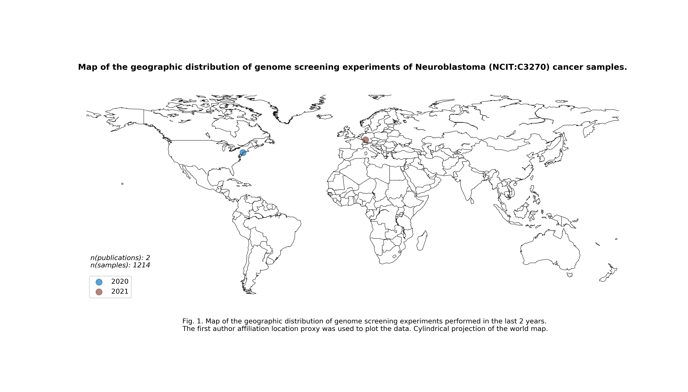
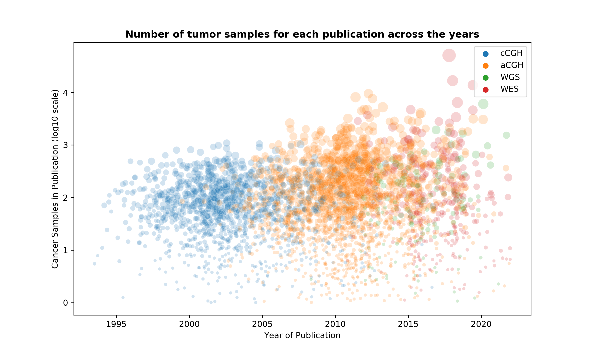
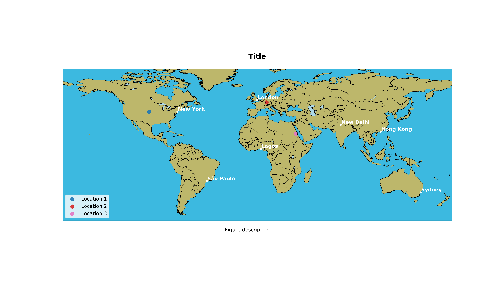

# pub-features-plotting

This repository gathers a series of scripts that can be used to plot various features of scientific publications found in the Progenetix publication collection on MongoDB. 

__Output of geoloc_specify.py:__

__Output of plot_features.py__

__Output of basic_world_map.py:__

__Animation:__
